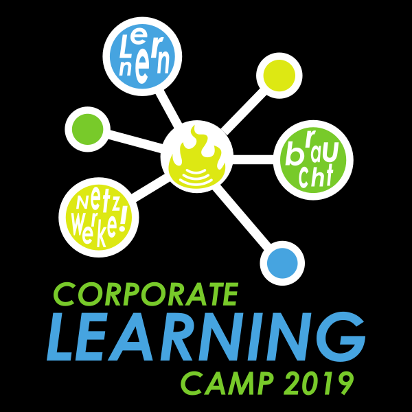
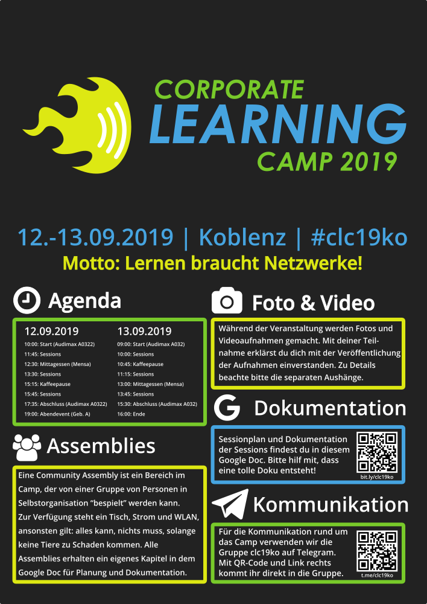

Digitale Assets für das Corporate Learning Camp 2019 in Koblenz (https://colearn.de/clc19ko).

# Badge und Aufkleber

Diese Grafik wird verwendet für: 1.) einen runden runden Aufkleber (Durchmesser: 9,5cm), der vor Ort an die Teilnehmer*innen verteilt wird ([über Wir machen Druck](https://www.wir-machen-druck.de/aufkleber-rund-95-cm-x-95-cm.html)) und 2.) ein [Open Badge](https://de.wikipedia.org/wiki/Open_Badges) (PNG-Grafik mit eingebetteten [JSON](https://de.wikipedia.org/wiki/JavaScript_Object_Notation) Linked Data). Der Badge wird an alle Personen, die sich mindestens an einem der beiden Tage registriert haben, am 14.09. per E-Mail verschickt (über [badgr.io](http://badgr.io)).

# T-Shirt und Hoodie

Dieses Motiv wird für das T-Shirt und den Hoodie zum Camp verwendet. Diese können über den [lernOS Learnwear Shop](https://shop.spreadshirt.net/lernos/) bestellt werden.

# Poster

Das Poster wird an mehreren Stellen der Camp-Lokation aufgehängt, damit die wichtigsten Informationen und Links immer im Blick sind. Die Dokumentation [im Google Doc](https://bit.ly/blp19ko) und die Kommunikation [in der Telegram-Gruppe](https://t.me/clc19ko) können per Kurzlink und QR-Code schnell erreicht werden. Der Ansatz zur Dokumentation und Kommunikation zum clc19ko ist [in diesem Blog auf colearn.de](https://colearn.de/dokumentation-und-kommunikation-auf-dem-corporate-learning-camp-2019-in-koblenz/) beschrieben.

