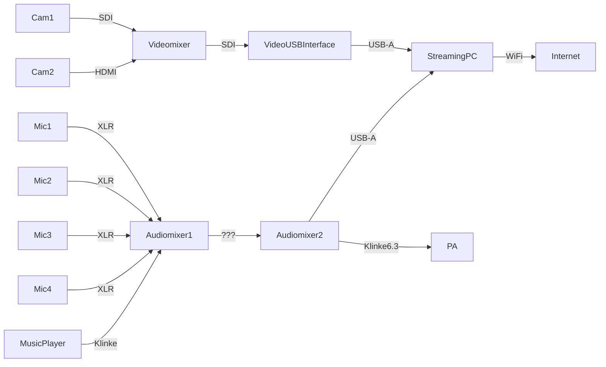

 Hybrides Setup für das 8. Zusammenarbeit 2.0 Barcamp bei Audi.

# Bühne
Setup mit zwei Kameras und drei (max. 4) Mikrofonen.

**Equipment:**

1. Cam1: [Canon XA25](https://wiki.cogneon.de/Canon_XA25)
1. Cam2: GoPro 4
1. Mic1-4: [Sennheiser XSW](https://wiki.cogneon.de/Sennheiser_XSW)
1. Audiomixer1: Behringer RX1202FX
1. Audiomixer2: [Yamaha AG06](https://wiki.cogneon.de/Yamaha_AG_Serie)
1. Videomixer: Blackmagic Television Studio
1. VideoUSBInterface: [Blackmagic Web Presenter](https://wiki.cogneon.de/Blackmagic_Web_Presenter)
1. StreamingPC: offen
1. PA: offen

# Breakout-Räume
4x [Hybrid Meeting Kit](https://wiki.cogneon.de/hmk) inkl. NUCs