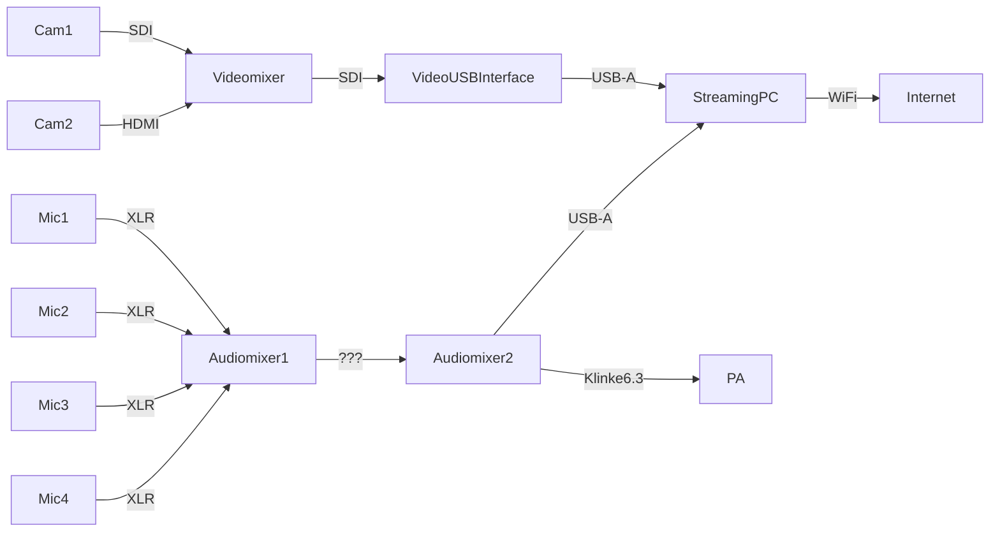

Hybrides Setup für das 8. Zusammenarbeit 2.0 Barcamp bei Audi.

# Bühne
Setup mit zwei Kameras und drei (max. 4) Mikrofonen.

# Breakout-Räume
[Hybrid Meeting Kits](https://wiki.cogneon.de/hmk) inkl. NUCs