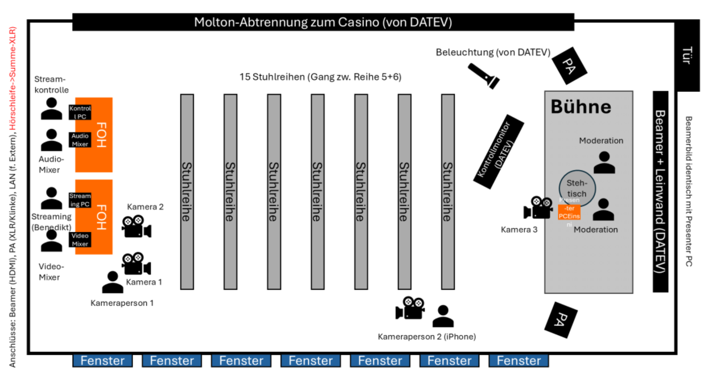
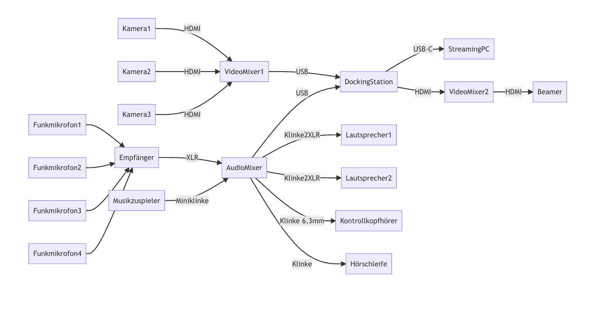
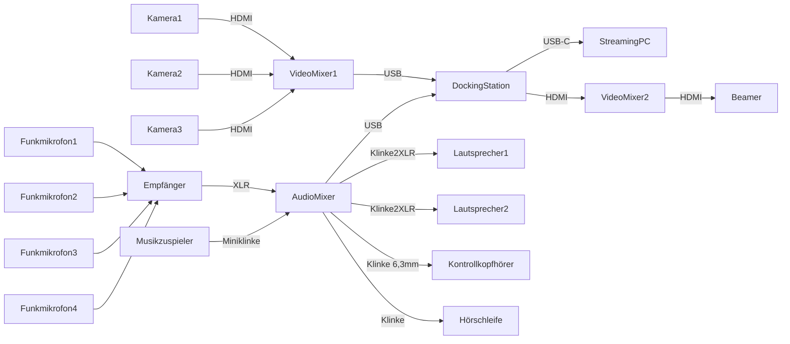

Dieser Ordner enthält Cogneon-Ressourcen für das DATEV DigiCamp am 24.10.2025, bei dem erstmals auch das hybride Plenum mit einem Team von Freiwilligen mit den Setup der lernOS Convention organisiert wurde. Als Videokonferenz-System wurde Zoom Events mit Zoom Webinaren und Zoom Meetings eingesetzt.

- **Wann:** 24.10.2025
- **Wo:** DATEV IT Campus, Nürnberg

# # Skizze Bühne

Das Plenum mit Bühne wurde als Pop-Up in einem abgegrenzten Teil der Kantine aufgebaut.

# BOM Technik Bühne

Für die Bühne verwenden wir zwei Kameras, Audio-/Videomixer und zwei Funk-Handmikrofone:

1. Funk-Mikrofone (4x): Sennheiser XS, 2x Handmikrofon, 2x Nackenbügelmikrofon
2. Audiomischer: Zoom LiveTrak L8 -> **WICHTIG:** der USB-Ausgang ist der Master Mix, das MUSS der Mix Minus sein, für die PA den Mix A verwenden.
3. Videomischer1: Blackmagick ATEM Mini Pro, Ausgang USB-C
4. Videomischer2: Blackmagick ATEM Mini Pro, Ausgang USB-C (haben wir verwendet, um zwischen Zoom und Standbild vor Ort umzuschalten)
5. Kamera 1: Canon Camcorder XA60
6. Kamera 2: Canon Camcorder XA25
7. Kamera 3: Action Cam
8. Kamera 4: Smartphone mit Zoom App auf Gimbal
9. Stative: 2x Manfrotto statisch
10. Gimbal 1x: für Smartphone -> das von Cogneon ist im Einsatz
11. Lautsprecher: von DATEV Event Team gestellt
12. Hörschleifen-Senter:von DATEV Event Team gestellt (für Barrierefreiheit, s.a. [Induktive Höranlage](https://de.wikipedia.org/wiki/Induktive_H%C3%B6ranlage))

# Signalflussplan

Mermaid-Code zum Weiterverwenden:

