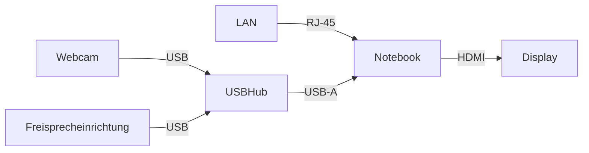
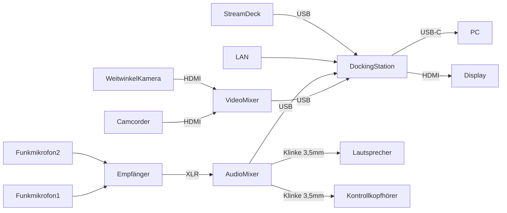

Dieser Ordner enthält Ressourcen für das [GfWM KnowledgeCamp 2022](https://gfwm.de/gkc22) (#gkc22) in Berlin und online.

- **Wann:** 13.-14.10.2022

- **Wo:** [The Student Hotel]([Berlin Mitte](https://www.thestudenthotel.com/de/berlin-mitte/)), Berlin & Online (Hybrid)

# Technik Session-Räume

**WICHTIG:** die Session Owner bringen IHRE EIGENEN Notebooks mit. Ist ein Session Owner Remot, muss einer der Vor-Ort-Teilnehmer_innen ihr Notebook anschließen.

**Notwendige Schnittstellen:** 1x USB-A, 1x HDMI, 1x LAN (ggf. Adapter mitbringen)

**Materialliste:**

- **Webcam:** Logitech C920 oder C930

- **Freisprecheinrichtung:** Jabra Speak 510 oder 710

# Technik Bühne

**Materialliste** (s.a. [COPEDIA Seite](https://wiki.cogneon.de/Multimedia_Schrank)):

- **PC:** Lenovo X1 Carbon (von Simon)

- **Docking Station:** Hyper Drive Gen2

- **Camcorder:** Canon XA25 (auf Stativ, Totale Bühne)

- **Weitwinkel-Kamera:** GoPro (auf Stativ, Totale Publikum)

- **VideoMixer:** Blackmagic ATEM Mini Pro (Pausenbild über ATEM, OBS aktuell nicht geplant)

- **Funkmikros/Empfänger:** Sennheiser XS Wireless 1

- **AudioMixer:** Zoom PodTrack P4 (USB MixMinus konfiguriert, Kanal 1: Funkmikro 1, Kanal 2: Funkmikro 2, Kanal 3: Reserve, Kanal 4: PC)

- **Lautsprecher:** von Location (in Klärung, Ausgang AudioMixer: 3,5mm Klinke)

- **Display:** von Location, Kabel vorhanden (in Klärung)