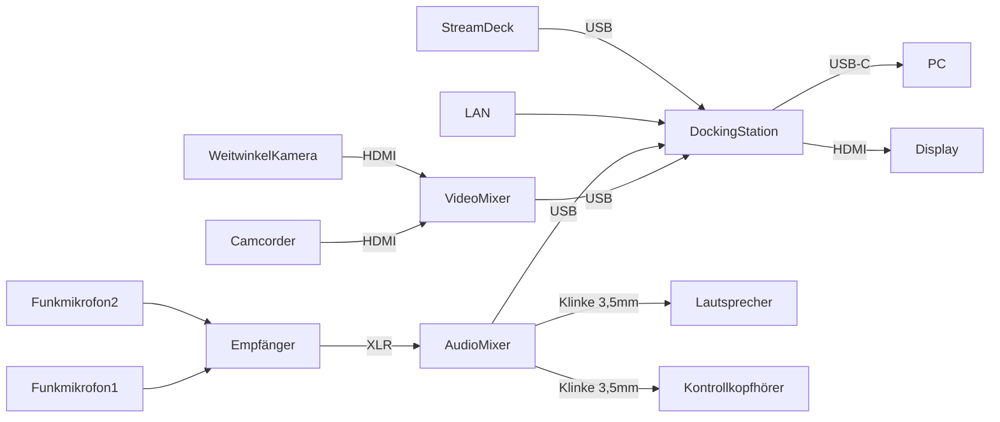

Dieser Ordner enthält Cogneon-Ressourcen für das [GfWM KnowledgeCamp 2025](https://gfwm.de/gkc25) (#gkc25) in Berlin und online. Wir stellen als Sponsor Technik für die hybride Bühne bereit.

- **Wann:** 23.-24.10.2022
- **Wo:** [frizzforum Berlin](https://www.frizzforum.de/)

# BOM Technik Bühne

Für die Bühne verwenden wir zwei Kameras, Audio-/Videomixer und zwei Funk-Handmikrofone:

1. Funk-Hand-Mikrofone (2x): Sennheiser XSW Dual (benötigt AA-Batterien) ([Anleitung](https://cloud.cogneon.de/s/wdYQEY7C6ZZHPKP))
2. Audiomischer: Yamaha AG06, Ausgang USB-A (Kopfhörer 6,3mm Klinke von GfWM) ([Anleitung](https://cloud.cogneon.de/s/bHYqE76EEQxAWoH))
3. Videomischer Blackmagick ATEM Mini, Ausgang USB-C ([Anleitung](https://cloud.cogneon.de/s/5eeZ7TXYaQ3WxFX))
4. Kamera 1: Panasonic Camcorder HC-X929 ([Anleitung](https://cloud.cogneon.de/s/Pd4NeQtMMZLakH7))
5. Kamera 2: Action Cam GoPro (alt)
6. Kabel
   1. 4x XLR-Mono kurz
   2. 2x XLR-Verlängerung
   3. 2x Mono-Klinke 6,3mm auf XLR (PA von Tim hat XLR, er legt aber auch Kabel bei)
   4. HDMI Kabel für Kameras auf Videomischer (3+m, im Pack sind weitere Kabel und Adapter, Kameras haben kleine HDMI-Anschlüsse)
7. Stative: 2x statisch (Simon: ich habe ein zweites Stativ im Lager gefunden (grau mit zwei Armen), das könnt ihr im Anschluss gerne behalten)
8. Gimbal 1x: für Smartphone -> das von Cogneon ist im Einsatz
9. Lautsprecher: the box pro Achat 404 A (von Tim Pritlove: Abholung durch Anne am 16.10. um 16:30 im Prenzlauer Berg geplant)

# Signalflussplan

# Weiterführende Links

* Pad zur Zusammenarbeit mit dem Technik-Team: https://pad.cogneon.io/p/r.3058e81813cf1cce82e06f4b2e213948 (read-only)