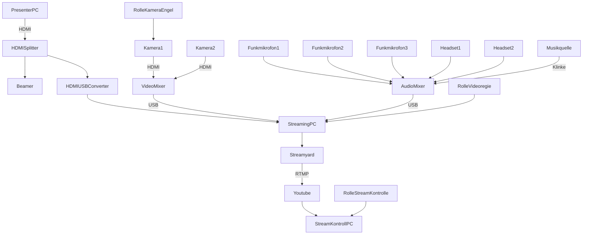
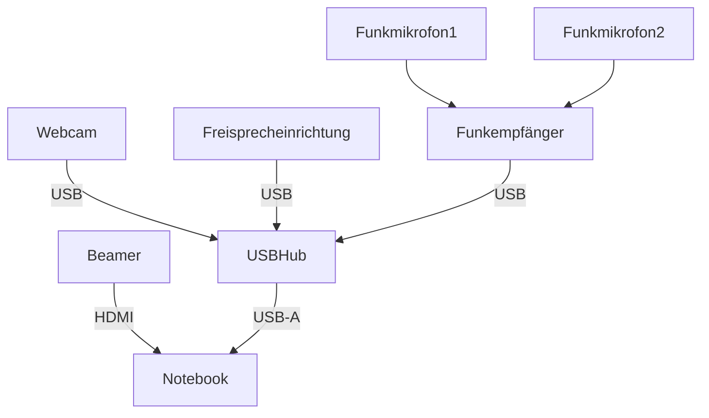

Dieser Ordner enthält die Ressourcen für die **lernOS Convention 2020** (loscon22). Alle Infos zur Veranstaltung unter https://cogneon.de/loscon22. Das Leitthema der Veranstaltung ist **"The Re-Return of Knowledge Management"**. Das visuelle Design ist in Anlehnung an den Film [Die Rückkehr der Jedi-Ritter](https://de.wikipedia.org/wiki/Die_R%C3%BCckkehr_der_Jedi-Ritter) an die Star Wars Filmreihe angelehnt. Der Font ist [Star Jedi Hollow]([https://www.dafont.com/star-jedi.font).

# Logo

# Key Visual

# Sticker

Druck erfolgt als gestanzte Sticker über [Stickermule](https://www.stickermule.com/) (300 Stück).

# Technik Bühne

Planungsstand Equipment:

* PresenterPC: Lenovo X1 Carbon (Simon)?
* StreamingPC: Lenovo X1 Carbon (Simon) oder NUC?
* HDMISplitter:
* HDMIUSBConverter: Elgato Cam Link
* Funkmikrofon 1/2/3: Sennheiser Handmikrofone
* Headset 1/2: Beyerdynamic DT297
* Musikquelle: iPad (Simon)
* Kamera 1: Canon XA25 auf Stativ mit Fernsteuerung
* Kamera 2: Panasonic HC X929
* VideoMixer: ATEM Mini
* AudioMixer: Zoom L12

# Technik Breakout Räume
Wir gehen davon aus, dass Session-Owner ihr eigenes **Notebook** mitbringen. Das Funkmikrofon 1 kann beim Session-Owner angeklipst werden, das Funkmikrofon 2 kann in einem Schaumstoffwürfel gesteckt und als Publikumsmikro verwendet werden. Alternativ liegt auch für Funkmikrofon 1 noch ein Schaumstoffwürfel bereit.

Planungsstand Equipment:
* Webcam: [OBSBOT Tiny 4K](https://www.obsbot.com/obsbot-tiny-4k)
* Freisprecheinrichtung [Jabra Speak 510](https://www.jabra.com.de/business/speakerphones/jabra-speak-series/jabra-speak-510##7510-209) und/oder [EPOS Expand 80](https://www.eposaudio.com/de/de/enterprise/products/expand-80-bluetooth-speakerphone-1000202)
* Funkmikrofon/-empfänger: [Rode Wireless Go II](https://de.rode.com/Wireless/Wirelessgo)
* USBHub:
* Notebook: von Session Owner mitgebracht, Mindestanforderung: HDMI, 1x USB-A
