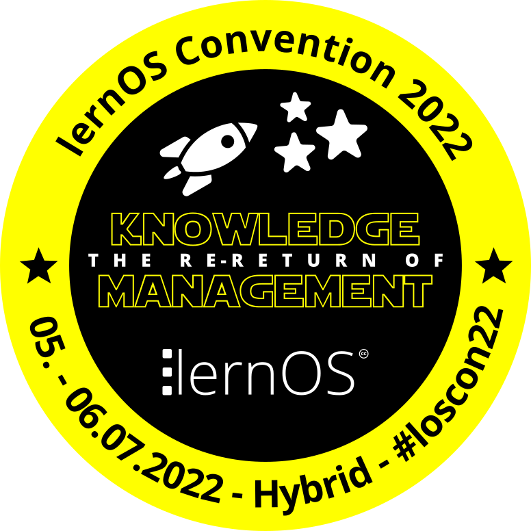
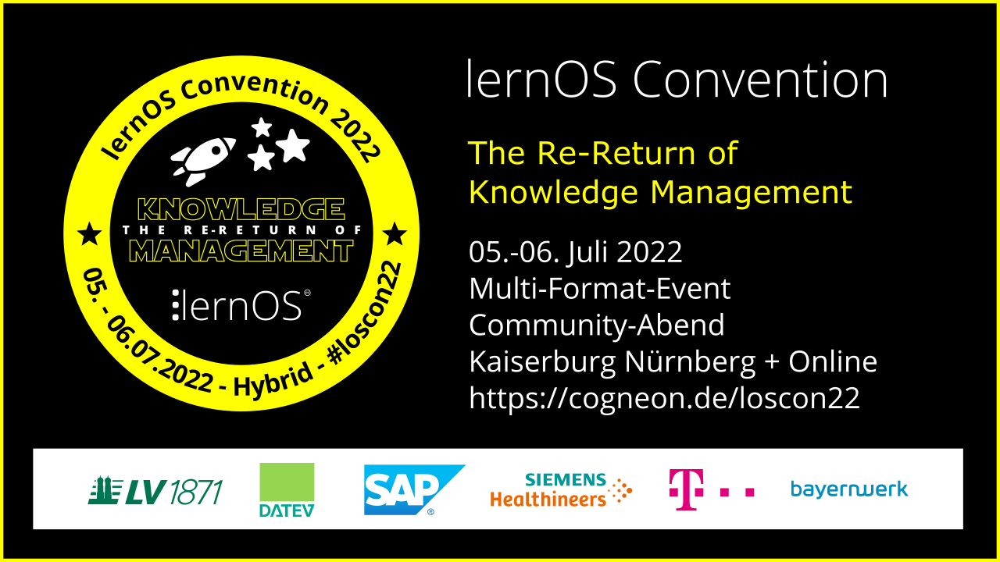
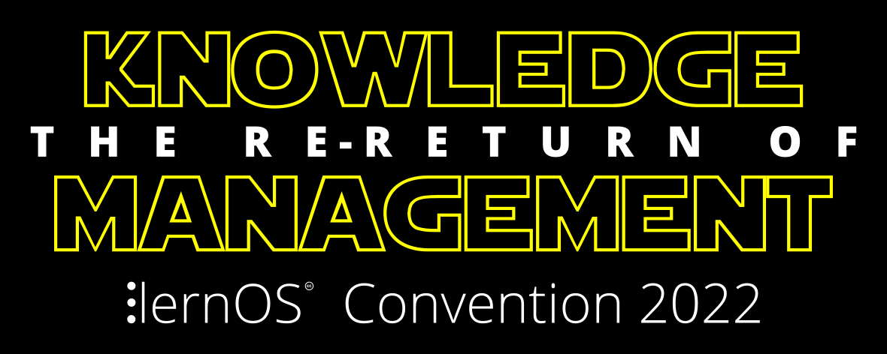
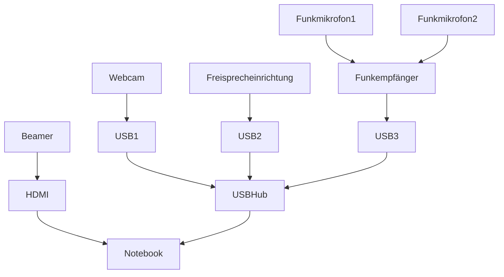

Dieser Ordner enthält die Ressourcen für die **lernOS Convention 2020** (loscon22). Alle Infos zur Veranstaltung unter https://cogneon.de/loscon22. Das Leitthema der Veranstaltung ist **"The Re-Return of Knowledge Management"**. Das visuelle Design ist in Anlehnung an den Film [Die Rückkehr der Jedi-Ritter](https://de.wikipedia.org/wiki/Die_R%C3%BCckkehr_der_Jedi-Ritter) an die Star Wars Filmreihe angelehnt. Der Font ist [Star Jedi Hollow]([https://www.dafont.com/star-jedi.font).

# Logo

# Key Visual

# Sticker

Druck erfolgt als gestanzte Sticker über [Stickermule](https://www.stickermule.com/) (300 Stück).

# Technik Breakout Räume
Wir gehen davon aus, dass Session-Owner ihr eigenes **Notebook** mitbringen. Als Freisprecheinrichtung wollen wir [Jabra Speak 510](https://www.jabra.com.de/business/speakerphones/jabra-speak-series/jabra-speak-510##7510-209) und/Oder [EPOS Expand 80](https://www.eposaudio.com/de/de/enterprise/products/expand-80-bluetooth-speakerphone-1000202) verwenden. Für die Funkmikrofone/-empfänger sind [Rode Wireless Go II](https://de.rode.com/Wireless/Wirelessgo) gelpant.

