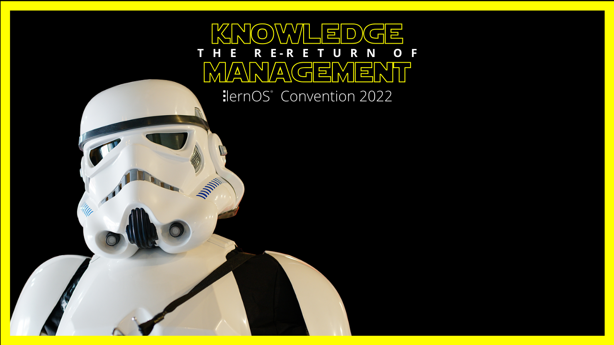

Dieser Ordner enthält die Ressourcen für die **lernOS Convention 2020** (loscon22). Alle Infos zur Veranstaltung unter https://cogneon.de/loscon22. Das Leitthema der Veranstaltung ist **"The Re-Return of Knowledge Management"**. Das visuelle Design ist in Anlehnung an den Film [Die Rückkehr der Jedi-Ritter](https://de.wikipedia.org/wiki/Die_R%C3%BCckkehr_der_Jedi-Ritter) an die Star Wars Filmreihe angelehnt. Der Font ist [Star Jedi Hollow]([https://www.dafont.com/star-jedi.font).

# Logo

# Key Visual

# Hintergründe
Hintergrundgrafiken z.B. für Microsoft Teams im Format 16:9 (1280x720px)

# Sticker

Druck erfolgt als gestanzte Sticker über [Stickermule](https://www.stickermule.com/) (300 Stück).

