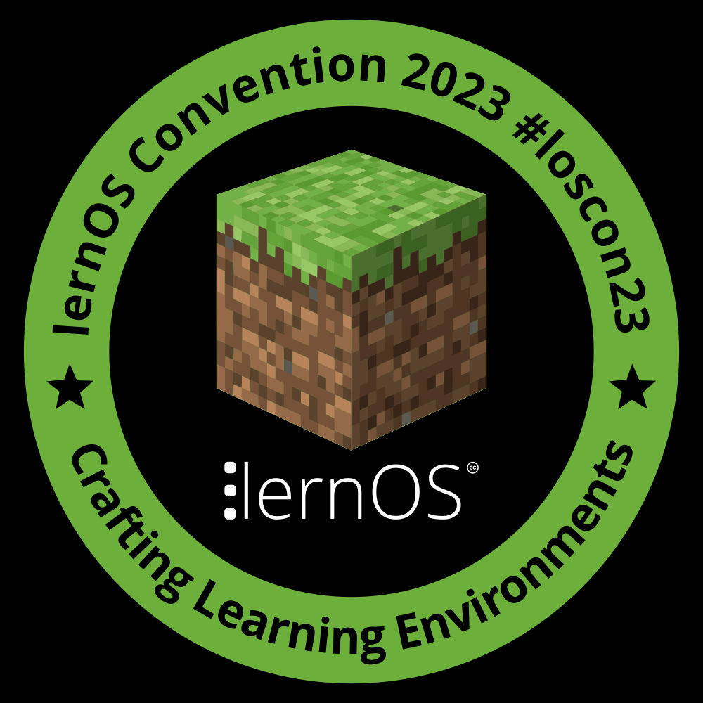
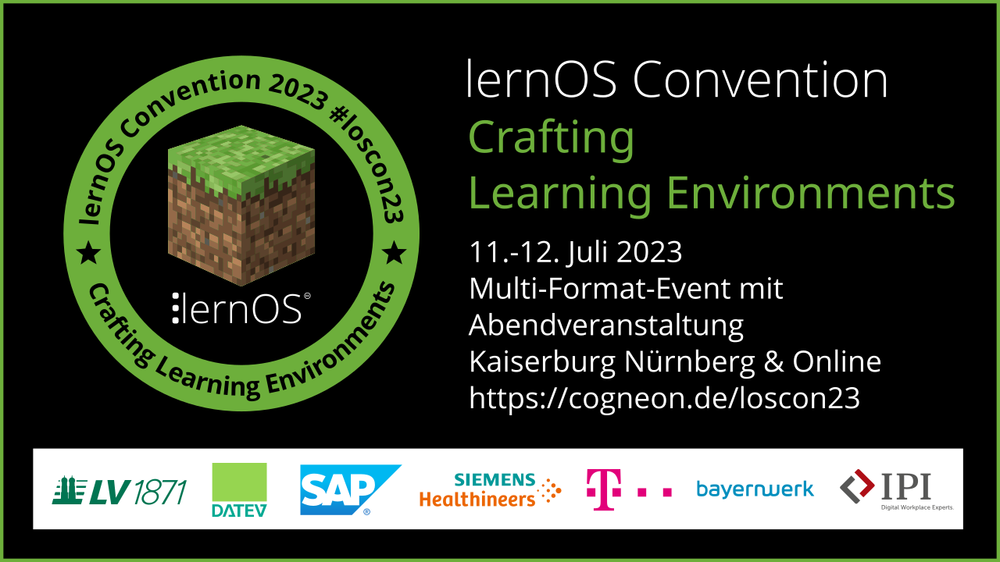
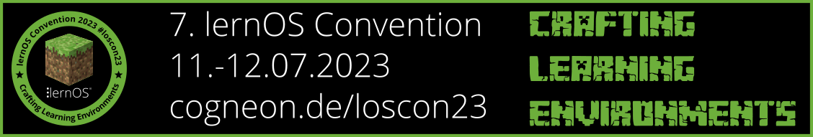
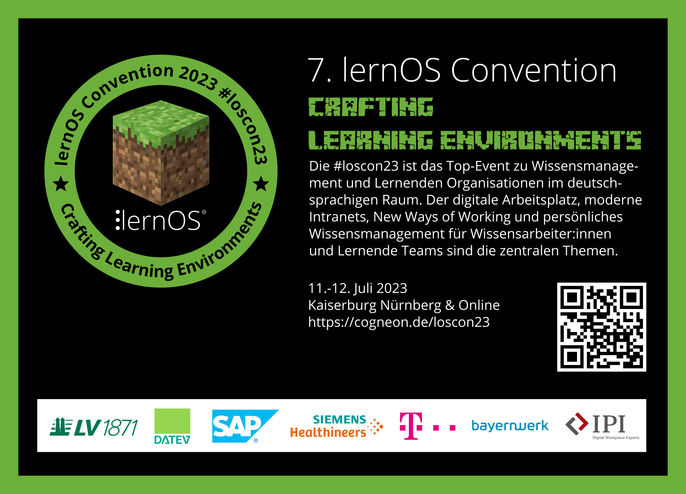
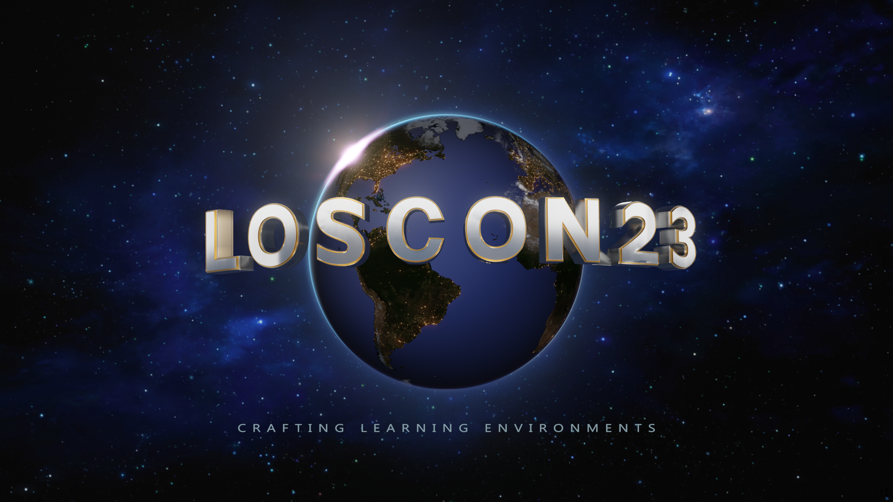

Dieser Ordner enthält die Ressourcen für die **lernOS Convention 2023** (loscon23). Alle Infos zur Veranstaltung unter https://cogneon.de/loscon23. Das Leitthema der Veranstaltung ist **"Crafting Learning Environments"**. Das visuelle Design ist in Anlehnung an das Spiel Minecraft bzw. die Open-Source-Variante [Minetest](https://minetest.net).

# Design

- Akzentfarbe: #6daf3bff

- Font: Minecrafter

# Badge

Das Badge wird nach der Veranstaltung als OpenBadge über badgr.io verteilt.

# Key Visual

Das Key Visual dient als Hauptgrafik bei Blog-Beiträgen, Kalender-Einträgen etc.

# Linkedin-Banner

# Logo

# Postkarte

Die Postkarte verwenden wir zum Verschicken und zum Verteilen bei Besprechungen und auf Veranstaltungen.

# Hintergründe

Hintergrundgrafiken z.B. für Microsoft Teams im Format 16:9 (1280x720px)

# Sticker

Druck erfolgt als gestanzte Sticker über [Stickermule](https://www.stickermule.com/) (300 Stück).

# Trailer

Videotrailer für die Eröffnung der loscon23 mit [Blender](https://www.blender.org/) erstellt.

