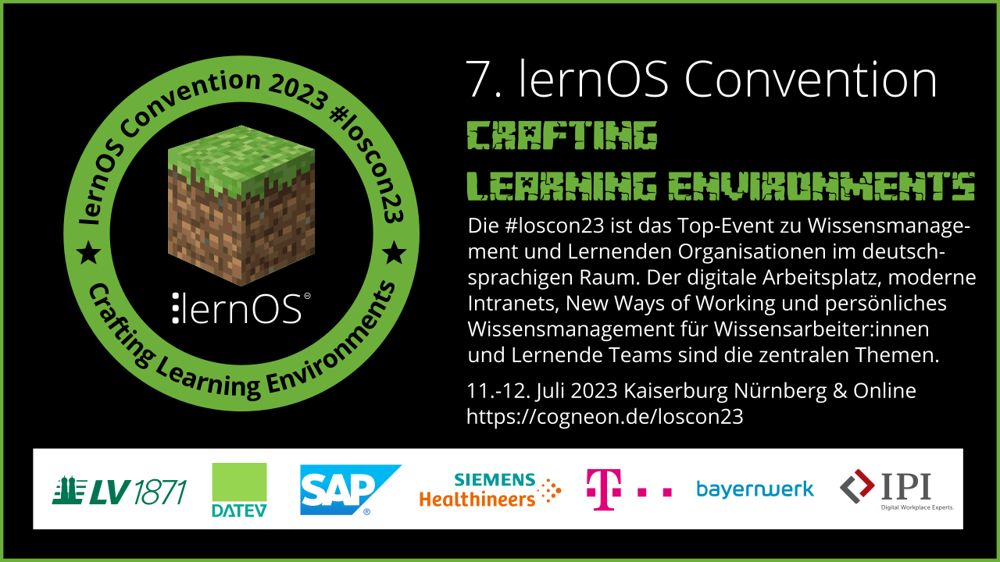

Dieser Ordner enthält die Ressourcen für die **lernOS Convention 2023** (loscon23). Alle Infos zur Veranstaltung unter https://cogneon.de/loscon23. Das Leitthema der Veranstaltung ist **"Crafting Learning Environments"**. Das visuelle Design ist in Anlehnung an das Spiel Minecraft bzw. die Open-Source-Variante [Minetest](https://minetest.net).

# Design

- Akzentfarbe: #6daf3bff

- Font: Minecrafter

# Badge

Das Badge wird nach der Veranstaltung als OpenBadge über badgr.io verteilt.

# Key Visual

Das Key Visual dient als Hauptgrafik bei Blog-Beiträgen, Kalender-Einträgen etc.

# Linkedin-Banner

# Logo

# Postkarte

Die Postkarte verwenden wir zum Verschicken und zum Verteilen bei Besprechungen und auf Veranstaltungen.

# Hintergründe

Hintergrundgrafiken z.B. für Microsoft Teams im Format 16:9 (1280x720px)

# Sticker

Druck erfolgt als gestanzte Sticker über [Stickermule](https://www.stickermule.com/) (300 Stück).

# Stückliste (BOM, Bill of Materials)

Die loscon23 BOM listet alle "Dinge", die wir für die Organisation der hybriden Veranstaltung verwendet haben. Sie dient als Vorlage für Zukünftige Veranstaltungen und kann gerne von anderen Organisatior:innen für eigene Veranstaltungen verwendet werden.

## Bühne

**Front of Hall (FOH)**

- Videomischer ATEM Mini Pro (an Streaming PC)
  
  - Kamera 1 Canon XA 25 (Closeup-Kamera)
  
  - Kamera 2 Panasonic HC-X929 (Totale Bühne)
  
  - Kamera 3 GoPro (Totale Raum von hinten)
  
  - Monitor für Videomix-Vorschau

- Audiomischer Zoom LiveTrak L-8 (an Streaming PC)
  
  - Funkstrecke Sennheiser XSW1 Dual (1x Handmikrofon, 1x Nachenbügelmikrofon)
  
  - Funkstrecke Sennheiser ew100 (mit Handmikrofon)
  
  - Mix Master ist Mix Minus (über USB an Streaming PC), Mix A ist unser Master Mix für die PA im Raum (über Stereo Klinke 6,3mm auf XLR auf Mixer Raum)

- Streaming PC Lenovo X1 Carbon

**Bühne**

- Presenter PC Lenovo X1 Carbon

- Kamera 4 (Totale Raum von vorne)

- Leinwand

- Kurzdistanz-Beamer (2. Display an der Bühne)

## Session/Assembly-Räume (4x)

[Cogneon Hybrid Meeting Kit](https://wiki.cogneon.de/hmk) mit:

- Room PC Intel NUC (per HDMI-Kabel an Beamer im Raum)

- Kamera Logitech C930e

- Speakerphone Jabra Speak 510 (als Lautsprecher)

- Funkmikrofone Rode Wireless Go II

- Schaumstoffwürfel für Rode Wireless Go II (2x)

- Handmikrofon-Adapter für Rode Wireless Go II (2x)

## Vernetzungsinseln (4x)

- Podcast PC Lenovo X200 (Win 11)

- Audio-Interface Zoom PodTrack P4 (2x), RodeCaster Pro (2x)

- Beyerdynamic DT 297 (12x)

## Infodesk

- Infodesk PC

- iPod für Einlass (mit Apps [pretixSCAN](https://pretix.eu/about/de/scan) und Discord)
