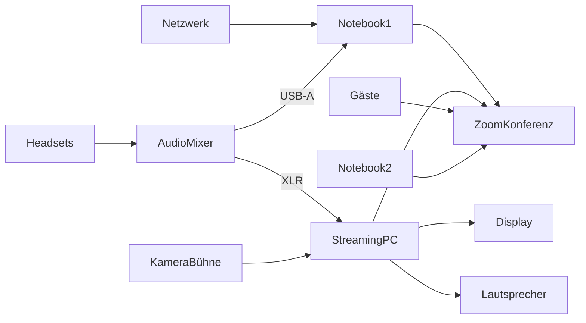

Dieser Ordner enthält Ressourcen für das [OERCamp 2022](https://www.oercamp.de/22/) (#oercamp22) in Hamburg, speziell die Podcast-Bühne, die im Rahmen eines der Barcamp-Tracks umgesetzt wird ([Tweet mit Bild vom Raum](https://twitter.com/OERcamp/status/1577669500887089152?s=20&t=Jc7gmpItmXsw9GGt9C49Aw)).

- **Wann:** 24.-26.10.2022 (Podcast-Bühne am 25.10.)

- **Wo:** Berufliche Schule für Medien und Kommunikation, Eulenkamp 46, 22049 Hamburg

# Technik Podcast-Bühne

**Materialliste:**

- **Notebook1:** Lenovo X1 Carbon (von Simon)

- **Notebook2:** Macbook Air M1 (von Simon, Chat-Moderation, WiFi reicht)

- **Display:** cTouch (vor Ort, in Klärung, ob Nutzung möglich)

- **Lautsprecher:** in Klärung (von equipvent)

- **AudioMixer:** Rodecaster Pro (von Joeran)

- **Klinke-XLR-Kabel:** für Übergang Audio von AudioMixer auf StreamingPC (von Simon, notwendige Länge in Klärung)

- **Headsets** 3x Beyerdynamic DT297 (von Joeran), Verwendung: Moderation, Simon, Gast (vor Ort)

- **Netzwerk:** noch offen, ob LAN oder WLAN

- **StreamingPC:** Rechner (von equipvent)

- **KameraBühne:** Totale der Bühne (von equipvent, Webcam oder Systemkamera z.B. Sony Alpha)

**Sonstiges:**

- Recording wird in Zoom gemacht (ohne Multitrack), Backup auf SD-Karte in AudioMixer (Multitrack)

- USB-Anschluss in Audiomixer auf MixMinus stellen, damit es kein Echo in Zoom gibt